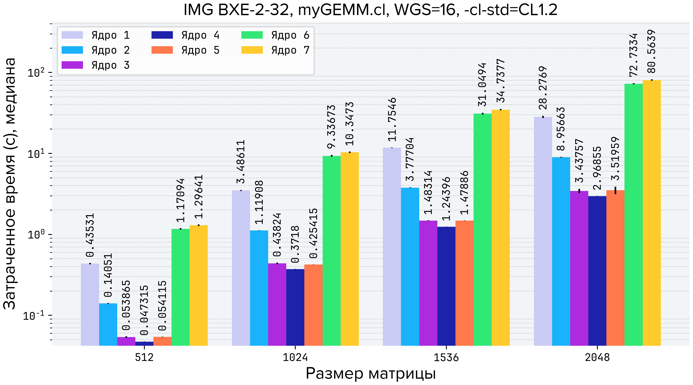
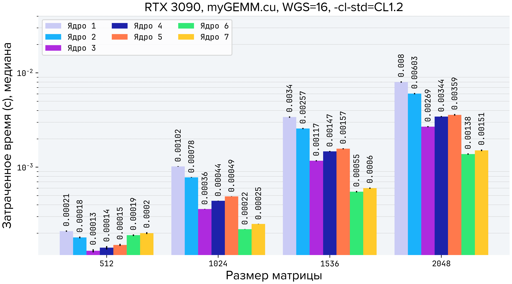

clGEMM
=============

This repo contains some files for YADRO 2025 Winter School.

Тестирование
=============

Для сбора данных можно использовать pull_data.py. Этот скрипт перенаправляет все аргументы для сборки в make.

	python3 pull_data.py <параметры>

Например,

	python3 pull_data.py ENABLE_CUDA=0

ENABLE_CUDA=0 нужно если собираем без CUDA, по умолчанию ENABLE_CUDA=1.

Скрипт будет последовательно выводить результаты экспериментов в формате CSV, но без заголовка. Сам же заголовок такой:

	backend,selected_kernel,work_group_size,cl_compiler_options,matrix_dimensions,elapsed_s

Чтобы записать данные в .csv файл, можно вывод перенаправить в, собственно, .csv файл.

	python3 pull_data.py ENABLE_CUDA=0 > out.csv

Так же можно воспользоваться мини-скриптом pull_to_file.sh, который выполнит в точности то же, что и команда выше.

Для выбора тестируемых ядер и work group size нужно изменить соответствующие переменные в pull_data.py (~70 строчка).

Небольшие заметка по поводу выбора параметров: похоже, что на большинстве устройств ядра 1-2 не работают с wgs 32, только с 16. Так же ядра > 3 могут не работать с маленьким wgs < 8.

Результаты
=============

Exploring the performance of SGEMM in OpenCL on NVIDIA GPUs
=============

Date: 31-Oct-2014 - 07-Nov-2014

Author: Cedric Nugteren, SURFsara (http://www.surfsara.nl)

This repository contains multiple OpenCL implementations of single-precision generalised matrix-multiplication (SGEMM) tuned for an NVIDIA Tesla K40m GPU. The different versions (named myGEMM) are part of a step-by-step tutorial, in which each step adds a new optimisation. The different steps and the details of the OpenCL kernel codes are all explained in depth at https://cnugteren.github.io/tutorial/pages/page1.html.

The OpenCL kernels can be used natively using the OpenCL framework. However, there is also a header-file included which converts the OpenCL kernels into CUDA syntax. This allows the same code to be tested through the CUDA-toolchain.

Apart from the OpenCL kernel codes, this repository contains fully working host code, including a loop over different matrix sizes and different BLAS libraries. It contains code to run NVIDIA's cuBLAS as a reference and the open-source clBlas library.

Pre-requisites:
* A C++ compiler (tested with GCC and ICC)
* The CUDA toolkit and NVCC compiler (tested with version 6.5)
* OpenCL headers and libraries (part of the CUDA toolkit)

Requirements to run the performance and correctness comparisons:
* The cuBLAS library (part of the CUDA toolkit, tested version 6.5)
* The open-source clBlas library (tested 2.2.0)

Usage
=============

*	Compile the code:

		make build

	Compiles the benchmarking infrastructure and the myGEMM kernels. Make sure there is a "bin" and "obj" directory available. Note that you might have to edit the Makefile to set the proper locations of the CUDA and OpenCL installations on your system.

*	Run the code:

		make run

	This runs the code for matrices ranging from MINSIZE to MAXSIZE (defined in src/common.h). It will run cuBLAS, clBlas, and the CUDA and OpenCL versions of the myGEMM kernels. The particular kernel to be executed is defined using the KERNEL keyword in src/settings.h. This file also contains other settings you might want to modify for your particular GPU.

*	Inspect the code:

		make inspect

	This generates all kinds of assembly-like versions of the CUDA kernels in the "bin" subdirectory. It also prints out statistics of the kernels such as the register usage.

Minimal working example
=============

Additionally, we supply the minimal.cpp file in the 'extra' directory. This file is a self-contained minimal working example (MWE) of the most basic SGEMM kernel (myGEMM1). This can be useful if you don't want to deal with Makefiles or don't have the CUDA, cuBLAS, or clBlas installed. Note that minimal.cpp misses some features compared to the main code, but we believe that it can nevertheless be a good starting point if you want to integrate myGEMM into your own code.

The code can be compiled using a regular C++ compiler and only requires OpenCL installed. Example compilation from the root folder:

	g++ -O3 -Wall -I/path/to/opencl/include extra/minimal.cpp -o bin/minimal -lOpenCL

Be aware that the minimal working example does not:
*	Iterate over multiple matrix sizes
*	Compare performance with cuBLAS or clBlas
*	Check for correctness of the results
*	Check for OpenCL errors
*	Load a kernel-file from disk, instead it is embedded as a string

###################################################
